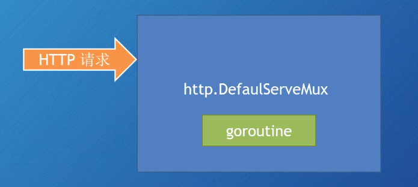
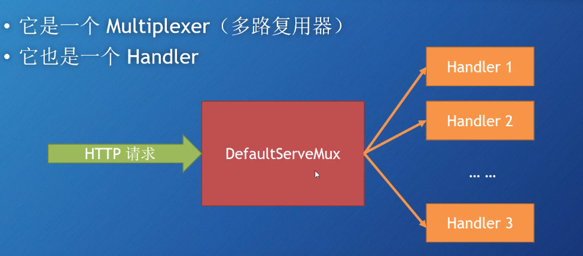
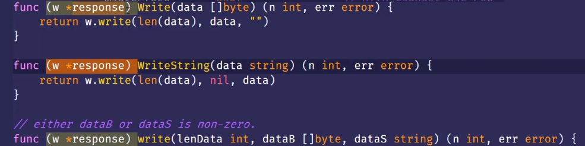
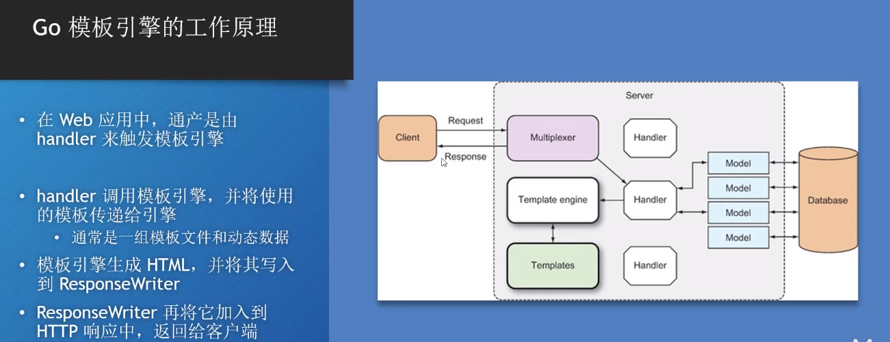

# golang 基础


## hello word

创建项目，使用**go mod** （*golang推荐的包管理工具）

`go mod init 01_hello_golang` //初始化mod

新建main.go

```go
package main //包名 main

import "fmt" //导入 fmt 包

//入口函数 main ， main函数必须定义在 main 包中
func main() {
	fmt.Println("hello golang !") //输出文本 换行结尾
}
```

`go run main.go` //编译运行

`go build main.go` //打包为可执行文件


## 变量 var

```go
package main

import "fmt"

var z = 999 //全局变量

func main() {
	//声明变量名称，类型 不赋值的话默认值为该数据类型的“零值”
	var a int
	fmt.Println(a)

	//声明变量名称，类型，并初始化变量值
	var b int = 5
	fmt.Println(b)

	//自动推导变量类型
	var c = 6
	fmt.Println(c)

	//声明多个变量
	var d, e = 2, 3
	var (
		f = 4
		g = "str"
	)
	fmt.Println(d, e, f, g)

	//短声明（常用） *但是不支持全局变量的声明
	h := 10
	i := 11
	fmt.Println(h, i)

	fmt.Println(z)
}
```


## 基础数据类型 data type

- bool

- int

  *u 有符号/无符号 uint8,uint16,uint32,uint64,int8,int16,int32,int64

- float32/float64

- string

- byte(uint8)

- rune(int32)

- ......


## 格式化输出动词 format_output_verb

%v	按值本身的格式输出，万能动词，不知道用什么动词就用它
%+v	同%v，但输出结构体时会添加字段名
%#v	输出值得Go语法表示
%t	格式化bool值
%b	按二进制输出
%c	输出整数对应的Unicode字符
%d	按十进制输出
%o	按八进制输出
%O	按八进制输出，并添加0o前缀
%x	按十六进制输出，字母小写，%x还能用来格式化字符串和[]byte类型，每个字节用两位十六进制表示，字母小写
%X	按十六进制输出，字母大写，%X还能用来格式化字符串和[]byte类型，每个字节用两位十六进制表示，字母小写
%U	按Unicode格式输出
%e	按科学计数法表示输出，字母小写
%E	按科学计数法表示输出，字母大写
%f	输出浮点数
%F	同%f
%g	漂亮的格式化浮点数
%G	同%G
%s	格式化为字符串
%q	格式化为字符串，并在两端添加双引号
%p	格式化指针
%T	输出变量类型
%w	专用于fmt.Errorf包装error


## 常量 const

```go
package main

import "fmt"

func main() {
	//定义常量
	const a = 1
	fmt.Println(a)

	//定义多个常量
	const (
		bj = 10
		sh //不赋值 默认和上一行相等
		sz //不赋值 默认和上一行相等
	)
	//10 10 10
	fmt.Println(bj, sh, sz)

	//iota 每当定义一个const，iota的初始值为0，逐行累加，可以参与计算
	const (
		aa = iota * 10
		bb
		cc
	)
	//0 10 20
	fmt.Println(aa, bb, cc)

	//iota 逐行累加，不是根据常量累加
	const (
		dd, ee = iota + 1, iota + 2
		ff, gg
	)
	//1 2 2 3
	fmt.Println(dd, ee, ff, gg)
}
```


## 函数 function

- 头等函数

  > 支持头等函数的语言允许将函数赋值给变量，作为参数传递给其他函数并从其他函数返回。 Go 支持头等函数功能。

- 匿名函数

  > 匿名函数就是没有名字的函数，在Go里也称作函数字面值。
  >
  > 因为函数字面值需要保留外部作用域的变量引用，所以函数字面值都是闭包的。

- 闭包

  > 闭包（closure）就是由于匿名函数封闭并包围作用域中的变量而得名的。

  

```go
package main

import "fmt"

//普通函数
func fun1(a int) int {
	return a + 1
}

//多返回值函数
func fun2(a, b int) (int, int) {
	return b, a
}

//指定返回参数
func fun3() (a, b int) {
	a, b = 1, 2
	return
}

//声明函数类型
type myFuncType func(int) int

//函数作为参数
func fun4(fun myFuncType) int {
	return fun(100)
}

func main() {
	a := fun1(2)
	fmt.Println(a)

	c, d := fun2(5, 10)
	fmt.Print(c, d)

	e, f := fun3()
	fmt.Println(e, f)

	//匿名函数 函数变量
	fun := func(i int) int {
		fmt.Println("func4 callback")
		return i + 1
	}
	g := fun4(fun)
	fmt.Println(g)

	//立即执行
	func(s string) {
		fmt.Println(s)
	}("golang!")

	//闭包
	h := 10
	fun1 := func() {
		fmt.Println(h)
	}
	fun1()
	h = 11
	fun1()
}

/*
	3
	10 51 2
	func4 callback
	101
	golang!
	10
	11
*/
```


## 方法 method

> 在其他面向对象语言里，方法属于类。
>
> 在Go里，提供了方法，但是没有提供类和对象，Go中的方法是与类型进行关联。

```go
package main

import "fmt"

//定义person结构体（类型）
type person struct {
	name string
	age  int
}

//为person类型关联方法 p:类型参数接收者，方法可以有多个参数返回值，但只能有一个接收者
//不能为int float等预声明的的类型进行关联，(起别名后再进行关联)
func (p person) say() {
	fmt.Printf("%+v\n", p)
}

func main() {
	p := person{name: "jack", age: 22}
	p.say() //调用
}
```


## defer

```go
package main

import "fmt"

// defer在return之后执行 当defer被声明时，其参数就会被实时解析
func a() {
	i := 0
	defer fmt.Println(i) // 0
	i++
	//return
}

// defer先定义后执行
func b() {
	for i := 0; i < 4; i++ {
		defer fmt.Println(i) // 3 2 1 0
	}
}

// defer可以读取带名称返回值
func c() (i int) {
	defer func() { i++ }()
	return 1
}

func main() {
	a()
	b()
	fmt.Println(c()) // 2  (闭包 ???)
}
```


## 数组 array

- 数组是类型相同的元素的集合，Go不允许在数组中混合使用不同类型的元素（比如整数和字符串）。
- 数组一旦声明，长度不可改变，数组的长度是数组类型的一部分。

- 在 Go 中数组是值类型而不是引用类型。这意味着当数组变量被赋值时，将会获得原数组的拷贝。新数组中元素的改变不会影响原数组中元素的值。

```go
package main

import "fmt"

func main() {
	//定义数组
	a := [3]int{1, 2}
	fmt.Println(a)

	//使用...根据{}中的元素个数推数组导长度
	b := [...]int{1, 2, 3}
	fmt.Println(b)

	//将数组赋值给一个新数组，新数组中元素的改变不会影响原数组中元素的值
	c := [...]string{"hello", "word"}
	d := c
	d[1] = "golang"
	fmt.Println(c, d)

	//遍历数组
	for i := 0; i < len(c); i++ {
		fmt.Println(c[i])
	}
	//使用range遍历
	for i, v := range d {
		fmt.Println(i, v)
	}

	//二维数组
	e := [2][3]int{{1, 2, 3}, {2, 3, 4}}
	for _, v1 := range e {
		for _, v2 := range v1 {
			fmt.Printf("%d ", v2)
		}
		fmt.Printf("\n")
	}
}
```


## 切片 silce

> 切片（slice）是建立在数组之上的更方便，更灵活，更强大的数据结构（窗口，视图）。切片并不存储任何元素而只是对现有数组的引用。


golang中数组和切片的区别：

●　切片是指针类型，数组是值类型

●　数组的长度是固定的，而切片不是（切片是动态的数组）

●　切片比数组多一个属性：容量（cap)

●　切片的底层是数组

```go
package main

import "fmt"

func main() {
	//创建了一个长度为 3 的 int 数组，并返回一个切片给 a
	a := []int{1, 2, 3}
	fmt.Println(a, len(a), cap(a)) //cap:切片最大容量

	//从b[2]-b[4]创建切片
	b := []int{1, 2, 3, 4, 5}
	c := b[2:4]
	fmt.Println(c)
	//改变切片值  将会影响原数组
	c[0] = 22
	fmt.Println(b)

	//golang提供append函数来添加元素，当使用append函数时，
	//append函数会判断目的切片是否具有剩余空间，如果没有剩余空间，则会自动扩充两倍空间。
	d := []int{1, 2, 3, 4, 5}
	d = append(d, 6, 7, 8)
	fmt.Println(d)

	/*
		切片保留对底层数组的引用。只要切片存在于内存中，数组就不能被垃圾回收。这在内存管理方便可能是值得关注的。
		假设我们有一个非常大的数组，而我们只需要处理它的一小部分，为此我们创建这个数组的一个切片，并处理这个切片。
		这里要注意的事情是，数组仍然存在于内存中，因为切片正在引用它。

		解决该问题的一个方法是使用 copy 函数 func copy(dst, src []T) int 来创建该切片的一个拷贝。
		这样我们就可以使用这个新的切片，原来的数组可以被垃圾回收。
	*/
	e := [...]int{10, 11, 12, 13}
	f := e[:2]
	g := make([]int, len(f))
	copy(f, g) // 将f复制到g
	fmt.Println(e, f, g)

	//三索引切片
	h := [...]string{"aaa", "bbb", "ccc", "ddd", "eee"}
	i := h[1:3]                    //bbb ccc
	fmt.Println(i, len(i), cap(i)) // [bbb ccc] 2 4
	//开始索引，结束索引，容量限制索引
	j := h[1:3:3]
	fmt.Println(j, len(j), cap(j)) // [bbb ccc] 2 2
}
```


## map

```go
package main

import "fmt"

// map 作为参数时 是引用传递。在其他方法中修改 会影响原map (赋值同理)
func fun1(m map[string]string) {
	m["guangzhou"] = "gz"
}

func main() {
	// 定义map
	a := map[string]string{
		"shanghai": "sh",
		"beijing":  "bj",
		"shenzhen": "sz",
	}
	fmt.Println(a)
	fun1(a)
	fmt.Println(a)

	// 访问不存在的key，value会返回该数据类型的默认值
	fmt.Println("wuhan=", a["wh"])
	// 用 ok 来判断 key 是否存在
	if m, ok := a["wuhan"]; ok {
		fmt.Println(m)
	} else {
		fmt.Println("wuhan not found...")
	}

	// 删除map中的key
	delete(a, "guangzhou")
	fmt.Println(a)
}
```


## 结构体 struct

> Go和其他经典语言不同，它没有class，没有对象，也没有继承。
>
> 但是Go提供了struct和方法。

- 构造函数（并非传统意义的构造函数，只是用来构造数据的一个函数）
  - 可以使用struct复合字面值来初始化你所需要的数据。
  - 但如果struct初始化的时候还要做很多事情，那就可以考虑写一个构造用的函数。
  - Go没有专用的构造函数，但以new或者New开头的函数，通常是用来构造数据的。例如：newPerson()，NewPerson()。
- New函数
  - 有一些用于构造的函数的名称就是New（例如errors包里面的New函数）。
  - 这是因为函数调用时使用 包名.函数名 的形式。
  - 如果该函数叫NewError，那么调用的时候就是errors.NewError()，这就不如errors.New()简洁。


```go
package main

import (
	"encoding/json"
	"fmt"
)

type person struct {
	name string
	age  int
}

// 构造 person 的函数  构造函数命名格式通常为new开头
func newPerson(name string, age int) person {
	//to do something...

	return person{name, age}
}

// 为 person 关联方法
func (p person) say() {
	fmt.Println("my name is", p.name)
}

func main() {
	// 复合字面值
	p := person{name: "tom", age: 22}
	fmt.Println(p)

	var p1 person
	p1.name = "jack"
	p1.age = 23
	fmt.Println(p1)

	// struct 复制，将struct实例赋值给新的实例，修改新的实例不会影响原实例
	p2 := p1
	p2.age = 24
	fmt.Println(p1, p2)

	// struct 转换为json
	type book struct {
		Name, Author, explain string
	}
	b := book{Name: "book", Author: "someone", explain: "explain..."}
	// Marshal函数只会对struct中被导出的字段进行编码（首字母大写）
	bt, _ := json.Marshal(b)
	fmt.Println(string(bt))

	// 使用"标签"来解决json格式的字段命名问题
	type book1 struct {
		Name   string `json:"name"` //如果有多种格式 `json:"name"xml:"name"`
		Author string `json:"author"`
	}
	b1 := book1{Name: "book1", Author: "someone1"}
	bt1, _ := json.Marshal(b1)
	fmt.Println(string(bt1))

	// 构造函数
	p3 := newPerson("xh", 25)
	fmt.Println(p3)

	p3.say() // 调用关联方法
}
```


## 组合 composition

- 在面向对象的世界中，对象由更小的对象组合而成。
- Go通过结构体实现组合（**composition**）
- Go提供了“嵌入”（**embedding**）特性，它可以实现方法的转发（**forwarding**）

- 凡是 **继承** 能实现的功能，通过 **组合** 都能实现。
- 组合是一种更简单、灵活的方式。


```go
package main

import "fmt"

// type computer struct {
// 	model    string
// 	keyboard keyboard
// 	mouse    mouse
// }

type computer struct {
	model    string
	keyboard // 嵌入  (只写类型名 可以嵌入预申明类型int string ...)
	mouse    // 嵌入
}

type keyboard struct {
	name         string
	model        string
	NumberOfKeys int
}

type mouse struct {
	name  string
	model string
	dpi   int
}

func (keyboard) input() {
	fmt.Println("input...")
}

func (mouse) click() {
	fmt.Println("click...")
}

func (keyboard) info() {
	fmt.Println("keyboard info...")
}

func (mouse) info() {
	fmt.Println("mouse info...")
}

//转发到mouse的info方法
func (c computer) info() {
	c.mouse.info()
}

func main() {
	m := mouse{name: "mouse1", model: "m-001", dpi: 1000}
	fmt.Printf("%+v\n", m)
	k := keyboard{name: "keyboard1", model: "k-001", NumberOfKeys: 112}
	fmt.Printf("%+v\n", k)
	c := computer{model: "c-001", mouse: m, keyboard: k}
	fmt.Printf("%+v\n", c)

	// c.mouse.click()  //方法转发
	// c.keyboard.input()  //方法转发

	c.click()                  //通过嵌入 方法转发
	c.input()                  //通过嵌入 方法转发
	fmt.Printf("%+v\n", c.dpi) //也可以转发属性

	//当嵌入转发的方法(属性)出现重名时，自身的方法(属性)优先级高于转发的方法。
	//c.mouse.info()
	c.keyboard.info()
	// mouse 和 keyboard 都有info方法，如果使用 c.info 会发生歧义（不确定是调用mouse的还是keyboard的）
	//如果非要通过c.info访问mouse的info方法，那么给computer关联一个info方法，然后转发到mouse的info方法
	c.info()
}
```


> 优先使用对象组合，而不是类的继承。
>
> 对传统的继承不是必须的；所有使用继承能解决的问题都可以通过其他方法解决。


## 接口 interface

- 接口关注于类型可以做什么，而不是储存了什么。
- 接口通过列举类型必须满足的一组方法来进行声明。
- 在Go语言中，不需要显式声明接口。

**接口类型**

- 为了复用，通常会把接口声明为类型。
- 按约定接口名称通常以 er 结尾。
- 接口可以与struct嵌入特性一同使用。
- 同时使用组合和接口将构成非常强大的设计工具。

**满足接口**

- Go标准库导出了很多只有单个方法的接口。
- Go通过简单的、通常只有单个方法的接口......来鼓励组合而不是继承，这些接口在各个组件之间形成了简明易懂的界限。


```go
package main

import (
	"fmt"
)

// 定义一个接口变量
var t interface {
	talk() string
}

// 定义结构体
type imp1 struct{}
type imp2 struct{}

//为imp1关联talk方法
func (imp1) talk() string {
	return "imp1"
}

//为imp2关联talk方法
func (imp2) talk() string {
	return "imp2"
}

// 声明接口类型
type talker interface {
	talk() string
}

func shout(talk talker) {
	fmt.Println(talk.talk())
}

type starship struct {
	imp1 // 嵌入 imp1 类型
}

func main() {
	t = imp1{} //imp1满足t这个接口
	fmt.Println(t.talk())
	t = imp2{} //imp2满足t这个接口
	fmt.Println(t.talk())

	imp1 := imp1{} //imp1满足talker这个接口
	shout(imp1)
	imp2 := imp2{} //imp2满足talker这个接口
	shout(imp2)

	// 因为 starship 嵌入了 imp1 类型，所以转发了 talk 方法
	s := starship{}
	fmt.Println(s.talk()) //所以 starship 可以直接调用 talk 方法
	shout(s)              //所以 starship 满足了 talker 这个接口，所以可以把 s 直接传给 shout 方法
}
```


## 指针 pointers

**什么是指针**

- 指针是指向另一个变量地址的变量。
- Go语言的指针同时也强调安全性，不会出现迷途指针（dangling pointers）

**& 和 * 符号**

- 变量会将它们的值存储在计算机的RAM里，存储位置就是该变量的内存地址。
- & 表示地址操作符，通过 & 可以获得变量的内存地址。
- & 操作符无法获得字符串、数值、布尔字面值的地址。
  - &42 ，&"hello" 这些都会导致编译器报错。
- *操作符与&的作用相反，它用来解引用，提供内存地址指向的值。

**注意**

- C语言中的内存地址可以通过例如 address++ 这样的指针运算进行操作，但是在Go里面不允许这种不安全操作。

**指针类型**

- 指针存储的是内存地址。
- 指针类型和其他普通类型一样，出现在所有需要用到类型的地方，如变量申明、函数形参、返回值类型、结构体字段等。

**指向结构体的指针**

- 与字符串和数值不一样，复合字面值的前面可以放置 & 符号。
- 访问字段时，对结构体指针进行解引用并不是必须的（自动解引用）。

**指向数组的指针**

- 和结构体一样,可以把 & 放在数组的复合字面值前面来创建指向数组的指针。
- 数组在执行索引或切片操作时会自动解引用。没有必要写(*superpower)[0]这种形式。
- 与C语言不一样，Go里面数组和指针是两种完全独立的类型。
- Slice和map的复合字面值前面也可以放置&操作符,但是Go并没有为它们提供自动解引用的功能。

**实现修改**

- Go语言的函数和方法都是按值传递参数的，这意味着函数总是操作于被传递参数的副本。
- 当指针被传递到函数时，函数将接收传入的内存地址的副本。之后函数可以通过解引用内存地址来修改指针指向的值。

**指针接收者**

- 方法的接收者和方法的参数在处理指针方面是很相似的。

- Go语言在变量通过点标记法进行调用的时候，自动使用 & 取得变量的内存地址。

  **注意**

  - 使用指针作为接收者的策略应该始终如一。
  - 如果一种类型的某些方法需要用到指针作为接收者，就应该为这种类型的所有方法都是用指针作为接收者。

**内部指针**

- Go语言提供了内部指针这种特性。
- 它用于确定结构体中指定字段的内存地址。
- & 操作符不仅可以获得结构体的内存地址，还可以获得结构体中指定字段的内存地址。

**隐式指针**

- Go语言里一些内置的集合类型就在暗中使用指针。

- map在被赋值或者呗作为参数传递的时候不会被复制。

  - map就是一种隐式指针

  - 这种写法就是多此一举: func demolishplanets*map[string]string)

- map的键和值都可以是指针类型。

- 需要将指针指向map的情况并不多见。

**slice指向数组**

- slice是指向数组的窗口，实际上slice在指向数组元素的时候也使用了指针。
- 每个slice内部都会被表示为一个包含3个元素的结构，它们分别指向:
  - 数组的指针
  - slice的容量
  - slice的长度
- 当slice被直接传递至函数或方法时，slice的内部指针就可以对底层数据进行修改。

- 指向slice的显式指针的唯一作用就是修改slice本身: slice的长度、容量以及起始偏移量。


```go
package main

import (
	"fmt"
)

type person struct {
	name, superpower string
	age              int
}

func main() {
	answer := 42
	address := &answer
	fmt.Println(address, *address)
	fmt.Printf("%T\n", address)

	// 指针指向的变量发生变化，指针解引用的值也会跟着变化
	answer = 43
	fmt.Println(*address)

	// 修改指针解引用的值，原变量也会变化
	*address = 44
	fmt.Println(answer)

	// 两个指针指向同一个地址时，它们相互影响
	address1 := address
	*address1 = 45
	fmt.Println(*address, *address1)
	// 2个指针指向的地址相等，那么它们就是相等的
	fmt.Println(address == address1)

	// 指针解引用赋给另一个变量，相当于是复制了一份副本，此时两个变量互不影响
	answer1 := *address
	*address = 46
	fmt.Println(answer1, *address)

	timmy := &person{
		name: "Timothy",
		age:  10,
	}
	//(*timmy).superpower = "flying"
	// 访问字段时，对结构体指针进行解引用并不是必须的
	timmy.superpower = "flying" // 和上一行 等效
	fmt.Printf("%+v\n", timmy)

	// 指向数组的指针
	superpowers := &[3]string{"flight", "invisibilisy", "super strength"}
	fmt.Println(superpowers[0])
	fmt.Println(superpowers[1:2])

	rebecca := person{
		name:       "Rebecca",
		superpower: "imagination",
		age:        14,
	}
	birthday(&rebecca)
	fmt.Printf("%+v\n", rebecca)

	//(&rebecca).birthday()
	rebecca.birthday() // 和上一行 等效
	fmt.Printf("%+v\n", rebecca)
}

func birthday(p *person) {
	p.age++
}

func (p *person) birthday() {
	p.age++
}
```


## goroutine / channel

```go
package main

import (
	"fmt"
	"math/rand"
	"time"
)

func main() {
	// 创建通道
	c := make(chan int)

	// 开启 5 个 goroutine 、 使用 go 关键字
	for i := 0; i < 5; i++ {
		go sleepyGopher(i, c) // 开启一个 goroutine 不会阻塞
	}

	// 从通道接收 5 次
	for i := 0; i < 5; i++ {
		gopherId := <-c // 从通道 c 接收数据，会阻塞。可以用于判断 goroutine 是否执行完毕（有点像 await）
		fmt.Println("gopher ", gopherId, " has finished sleeping")
	}

	fmt.Println("=======================================")

	c1 := make(chan int)
	// time.After 返回一个通道，该通道在指定时间后会接收到一个值，发送该值的 goroutine 是 go 运行时的一部分
	timeout := time.After(2 * time.Second)
	for i := 0; i < 5; i++ {
		go sleepyGopher1(i, c1)
	}
	rand.Seed(time.Now().UnixNano())
	for i := 0; i < 5; i++ {
		select {
		case gopherId := <-c1: // 从 c1 通道等待一个值
			fmt.Println("gopher ", gopherId, " has finished sleeping")
		case <-timeout: // c1 通道 2s 没有值则会走此 case
			fmt.Println("my patience ran out")
			//return
		}
	}

	fmt.Println("=======================================")
	c2 := make(chan int)
	go sleepyGopher2(c2)
	// 使用 range 关键字 从通道接收数据，直到通道被关闭
	for a := range c2 {
		fmt.Println(a)
	}

	fmt.Println("end...")
}

func sleepyGopher(id int, c chan int) {
	time.Sleep(3 * time.Second) // 休眠 3s
	fmt.Println("...", id, " snore ...")
	c <- id // 将 id 发送到通道 c 代表当前方法执行完毕
}

func sleepyGopher1(id int, c chan int) {
	time.Sleep(time.Duration(rand.Intn(4000)) * time.Millisecond) // 随机休眠
	fmt.Println("...", id, " snore ...")
	c <- id // 将 id 发送到通道 c 代表当前方法执行完毕
}

func sleepyGopher2(c chan int) {
	for i := 0; i < 5; i++ {
		time.Sleep(time.Duration(rand.Intn(4000)) * time.Millisecond) // 随机休眠
		fmt.Println("...", i, " snore ...")
		c <- i // 将 id 发送到通道 c 代表当前方法执行完毕
	}
	close(c)
}

```


# golang web开发

## hello word

```go
package main

import "net/http"

func main() {
	http.HandleFunc("/", func(rw http.ResponseWriter, r *http.Request) {
		rw.Write([]byte("hello word !"))
	})

	http.ListenAndServe(":8080", nil) // DefaultServeMux
}
```

- 处理请求

  
  Handler 为每个 http 请求创建一个 goroutine

## 创建 Web Server

```go
package main

import "net/http"

func main() {
	// 方法1 实际上是调用了 http.Server这个结构体 的 ListenAndServe方法
	//http.ListenAndServe(":8080", nil)
	//http.ListenAndServeTLS ...

	// 方法2 配置更灵活
	server := http.Server{
		Addr:    ":8080",
		Handler: nil,
	}
	server.ListenAndServe()
	//server.ListenAndServeTLS ...

	// 以上2种方法是等效的
}
```

## Handler

```go
type Handler interface {
	ServeHTTP(ResponseWriter, *Request)
}
```

- handler 是一个接口（interface）
- handler 定义了一个方法 ServeHTTP()
  - 参数1：HTTPResponseWriter
  - 参数2：指向 Request 这个 struct 的指针

### DefaultServeMux

- 是一个 Multiplexer 多路复用器
- 也是一个 Handler



### 自定义 Handler

```go
package main

import "net/http"

type myHandler struct{}

func (m myHandler) ServeHTTP(rw http.ResponseWriter, r *http.Request) {
	rw.Write([]byte("myHandler"))
}

func main() {
	// 使用自定义Handler
	mh := myHandler{}
	server := http.Server{
		Addr:    ":8080",
		Handler: mh,
	}
	server.ListenAndServe()
}

```

#### 为不同的路径指定不同的 Handler

- http.Handle
  - 第2个参数是 Handler
- http.HandleFunc
  - 第2个参数是 Handler 函数
  - HandlerFunc 可以把 Handler 函数转化为 Handler
  - 内部还是调用的 http.Handle

```go
package main

import "net/http"

type myHandler struct{}

func (m myHandler) ServeHTTP(rw http.ResponseWriter, r *http.Request) {
	rw.Write([]byte("myHandler"))
}

func main() {
	mh := myHandler{}
	server := http.Server{
		Addr:    ":8080",
		Handler: nil, //使用 DefaultServeMux
	}
	// 为路径 /my 指定 handler
	http.Handle("/my", mh)
	// 使用 http.HandleFunc，http.HandleFunc内部使用http.HandlerFunc类型转换（http.HandlerFunc是一个函数类型，本身就是一个handler），将具有适当签名的函数转换为一个handler 本质还是调用 http.Handle
	http.HandleFunc("/home", func(rw http.ResponseWriter, r *http.Request) {
		rw.Write([]byte("home"))
	})
	server.ListenAndServe()
}

```

### 内置的 Handlers

- NotFoundHandler

- RedirectHandler

- StripPrefix

- TimeoutHandler

- FileServer

  ```go
  package main
  
  import "net/http"
  
  func main() {
  	// 静态文件 server
  
  	// 1
  	// http.HandleFunc("/", func(rw http.ResponseWriter, r *http.Request) {
  	// 	http.ServeFile(rw, r, "wwwroot"+r.URL.Path)
  	// })
  	// http.ListenAndServe(":8080", nil)
  
  	// 2
  	http.ListenAndServe(":8080", http.FileServer(http.Dir("wwwroot")))
  }
  
  ```

## Request

- Request（是个 struct），代表了客户端发送的 HTTP 请求消息
- 重要的字段
  - URL
  - Header
  - Body
  - Form/PostForm/MultipartForm

```go
package main

import (
	"encoding/json"
	"fmt"
	"net/http"
)

type Person struct {
	Name string
	Tags []string
}

func main() {
	http.HandleFunc("/post", func(rw http.ResponseWriter, r *http.Request) {
		// 读取查询参数
		fmt.Fprintln(rw, r.URL.RawQuery)
		fmt.Fprintln(rw, r.URL.Query())
		fmt.Fprintln(rw, r.URL.Query()["id"])
		fmt.Fprintln(rw, r.URL.Query().Get("id"))

		// 读取 Hander 参数
		fmt.Fprintln(rw, r.Header)
		fmt.Fprintln(rw, r.Header["My-Header"])
		fmt.Fprintln(rw, r.Header.Get("My-Header"))

		// 读取 request body 内容
		body := make([]byte, r.ContentLength)
		r.Body.Read(body)
		fmt.Fprintln(rw, string(body))

		// r.ParseForm()
		// r.Form["key"]
		// r.FormValue("key")
		// r.PostForm["key"]
		// r.PostFormValue("key")
		// r.FormFile("key")

		// r.ParseMultipartForm(1024)
		// r.MultipartForm["key"]
		// r.MultipartForm.File["uploadfile"][0].Open()

		// r.MultipartReader() // 以 steam 读取
	})

	// 返回 json 数据
	http.HandleFunc("/json", func(rw http.ResponseWriter, r *http.Request) {
		rw.Header().Set("Content-Type", "application/json")
		p := &Person{
			Name: "haha",
			Tags: []string{"aa", "bb", "cc"},
		}
		j, _ := json.Marshal(p)
		//rw.WriteHeader(http.StatusOK)
		rw.Write(j)
	})

	http.ListenAndServe(":8080", nil)
}

```

## ResponseWriter

ResponseWriter 是一个接口，handler 用它来返回响应

真正支撑 ResponseWriter 的幕后 struct 是非导出的 http.response


http.response 的指针实现了 ResponseWriter 这个接口，所以 ResponseWriter 代表了 http.response 的指针，所以 w 本质上也是一个指针，按引用传递



### 内置响应

- http.NotFound
- http.ServeFile
- http.ServeContent
- http.Redirect

## 模板



- 模板必须是可读的文本格式，扩展名任意。对于web应用通常就是html
- text/template    通用模板引擎
- html/template    html模板引擎
- 模板内嵌的命令叫做 action
  - {{ . }}    这里的 “.” 就是一个 action 
  - 它可以命令模板引擎将其替换成一个值

```go
package main

import (
	"net/http"
	"text/template"
)

func main() {
	server := http.Server{
		Addr: ":8080",
	}

	http.HandleFunc("/hello", func(rw http.ResponseWriter, r *http.Request) {
		t, _ := template.ParseFiles("template/index.html")
		t.Execute(rw, "Hello Word!")
	})

	server.ListenAndServe()
}

```

### 模板解析

- ParseFiles

  解析模板文件（可以多个）

- ParseGlob

  解析所有符合规则的模板文件

- Parse

  直接解析字符串。ParseFiles、ParseGlob最终都会调用Parse

```go
// 1
// t := template.New("index.html")
// t, _ = t.ParseFiles("template/index.html")

// 2
t, _ := template.ParseFiles("template/index.html")

// 3 解析所有符合规则的模板
//t, _ := template.ParseGlob("template/*.html")

// 4 直接解析字符串
// t := template.New("index.html")
// t.Parse("<html><head><title>Document</title></head><body>{{.}}</body></html>")
```

- Lookup 方法

  通过模板名来寻找模板，如果没有找到就返回nil

- Must 函数

  可以包裹一个函数，返回一个模板的指针和一个错误

  如果错误不为nil，程序就会panic

  用于程序启动时监测

### 模板执行

- Execute

  适用于单个模板，模板集时只用第一个模板

- ExecuteTemplate

  适用于模板集，可以指定使用的模板名

```go
package main

import (
	"log"
	"net/http"
	"text/template"
)

func main() {
	ts := loadTemplates()
	http.HandleFunc("/", func(rw http.ResponseWriter, r *http.Request) {
		filename := r.URL.Path[1:]
		t := ts.Lookup(filename)
		if t != nil {
			err := t.Execute(rw, "hello word!")
			if err != nil {
				log.Fatalln(err.Error())
			}
		} else {
			http.NotFound(rw, r)
		}
	})

	http.Handle("/css/", http.FileServer(http.Dir("static")))
	http.Handle("/img/", http.FileServer(http.Dir("static")))

	http.ListenAndServe(":8080", nil)
}

func loadTemplates() *template.Template {
	ts := template.New("templates")
	template.Must(ts.ParseGlob("templates/*.html"))
	return ts
}
```

### Action

```go
{{ . }}

// 条件 action
{{ if . }}

{{ else }}

{{ end }}

// 循环、迭代 action
{{ range . }}
	{{ . }} // 代表 item
{{ else }}
    no data // 回落机制 循环无数据时走else
{{ end }}

// 设置 action
{{ with "word" }} // 将 . 暂时设置为别的值
	
{{ else }} // 回落机制
    
{{ end }}

// 包含 action
{{ template "name" arg }} // 在一个模板中包含其他模板 传入 arg 参数

// 定义 action
{{ define "name" }}
	<html></html> ...
{{ end }}

// block
{{ block "name" arg }}
	xxx  // 如果找不到 name 模板，则输出
{{ end }}
```

### 自定义函数

```go
ts := template.New("templates")
ts.Funcs(template.FuncMap{"myfunc": func(s string) string {
	return s + "..."
}})

ts.ParseFiles...

// 使用
{{ . | myfunc}}
```

### 组合模板

```go
package main

import (
	"net/http"
	"text/template"
)

func main() {
	http.HandleFunc("/", func(rw http.ResponseWriter, r *http.Request) {
		filename := r.URL.Path[1:]
		t, err := template.ParseFiles("templates/layout.html", "templates/"+filename, "templates/foot.html")
		if err != nil {
			http.NotFound(rw, r)
			return
		}

		//t.Execute(rw, nil) // 默认执行layout.html 那么index.html,home.html中就无需写{{ template "layout.html"}}
		t.ExecuteTemplate(rw, filename, nil)
	})

	http.ListenAndServe(":8080", nil)
}

```

```html
###################### layout.html:

<!DOCTYPE html>
<html lang="en">
  <head>
    <meta charset="UTF-8" />
    <meta http-equiv="X-UA-Compatible" content="IE=edge" />
    <meta name="viewport" content="width=device-width, initial-scale=1.0" />
    <title>layout</title>
  </head>
  <body>
    <h1>hello</h1>
    {{ block "content" .}}{{ end }} 
    
    {{ template "foot" . }}
  </body>
</html>


###################### foot.html

{{ define "foot" }}
<p>foot...</p>
{{ end }}


###################### index.html

{{ template "layout.html"}} 

{{ define "content" }}
<p>index</p>
{{ end }}


###################### home.html

{{ template "layout.html"}} 

{{ define "content" }}
<p>home</p>
{{ end }}

```


# golang 数据库


